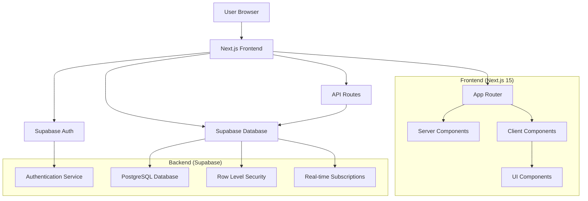

# Architecture Overview

## System Architecture

Sozluk follows a modern full-stack architecture using Next.js for the frontend and Supabase for the backend services.



## Technology Stack

### Frontend
- **Framework**: Next.js 15 with App Router
- **Language**: TypeScript with strict mode
- **Styling**: Tailwind CSS + Shadcn/ui components
- **State Management**: React Context (AuthProvider)
- **Forms**: React Hook Form + Zod validation

### Backend
- **BaaS**: Supabase (Backend as a Service)
- **Database**: PostgreSQL with Row Level Security
- **Authentication**: Supabase Auth with session management
- **Real-time**: Supabase real-time subscriptions

### Key Design Patterns

1. **Server-First Architecture**
   - Server Components by default
   - Client Components only when needed
   - Progressive enhancement approach

2. **Authentication Flow**
   - Client-side authentication with session management
   - Context-based state management
   - Automatic session refresh and recovery

3. **Data Flow**
   - API Routes for server-side operations
   - Client-side Supabase calls for real-time features
   - Optimistic updates where appropriate

## Directory Structure

```
frontend/
├── app/                     # Next.js App Router
│   ├── (auth)/             # Auth route group
│   ├── api/                # API routes
│   ├── add-word/           # Admin word addition
│   └── globals.css         # Global styles
├── components/             # React components
│   ├── ui/                 # Shadcn/ui components
│   ├── AuthProvider.tsx    # Auth context
│   └── Navbar.tsx          # Navigation
├── lib/                    # Utilities and configs
│   ├── supabase*.ts        # Supabase clients
│   └── utils.ts            # Helper functions
└── public/                 # Static assets
```

## Security Architecture

### Authentication
- **Session Management**: Automatic token refresh
- **Role-Based Access**: Admin vs regular user permissions
- **Route Protection**: Server and client-side guards

### Database Security
- **Row Level Security (RLS)**: All tables protected
- **User Isolation**: Users can only access their own data
- **Admin Controls**: Separate policies for admin operations

### API Security
- **Server-side Validation**: All inputs validated
- **Error Handling**: Secure error messages
- **Rate Limiting**: Built-in with Supabase

## Performance Considerations

### Next.js Optimizations
- **Server Components**: Reduced client bundle size
- **Image Optimization**: Automatic with next/image
- **Code Splitting**: Automatic route-based splitting
- **Caching**: Built-in caching strategies

### Database Optimizations
- **Indexing**: Optimized queries for search
- **Connection Pooling**: Handled by Supabase
- **Query Optimization**: Efficient data fetching patterns

## Scalability

### Horizontal Scaling
- **Stateless Design**: No server-side session storage
- **CDN Ready**: Static assets optimized for CDN
- **Database Scaling**: Supabase handles scaling automatically

### Performance Monitoring
- **Next.js Analytics**: Built-in performance monitoring
- **Supabase Dashboard**: Database performance metrics
- **Error Tracking**: Comprehensive error handling

## Development Workflow

1. **Local Development**: Next.js dev server with hot reload
2. **Database Changes**: Supabase migrations and schema updates
3. **Testing**: Component and integration testing
4. **Deployment**: Automated builds with Vercel

## Next Steps

- [Frontend Architecture](./frontend-architecture.md)
- [Backend Architecture](./backend-architecture.md)
- [Database Schema](./database-schema.md)